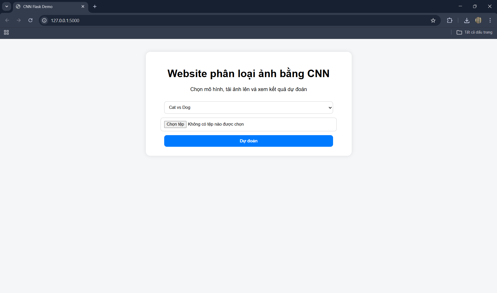
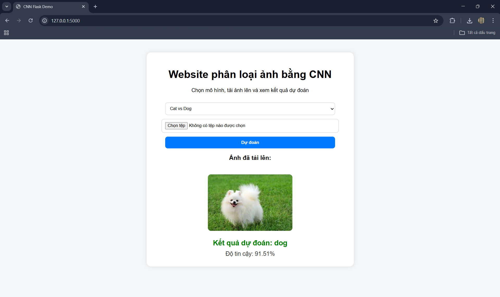
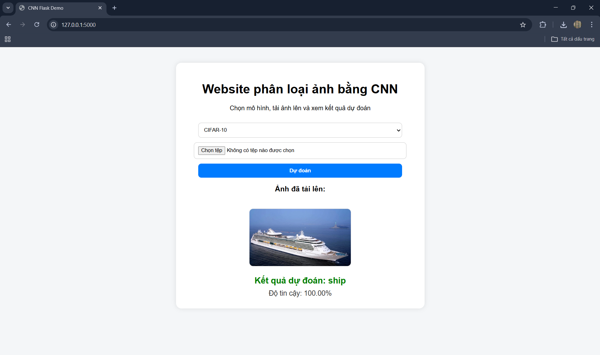
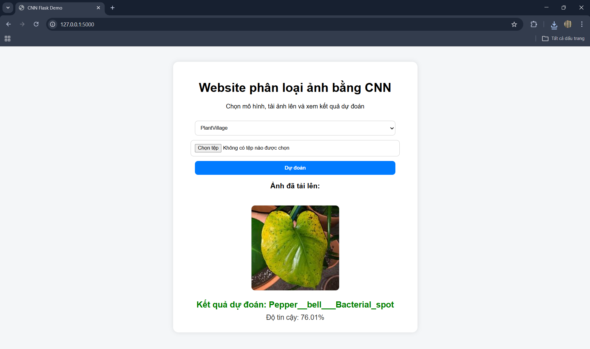

# Website phân loại ảnh bằng CNN sử dụng Flask

## 1. Giới thiệu
Bài lab này xây dựng một website cơ bản bằng Flask để kiểm tra trực tiếp các mô hình CNN đã được huấn luyện từ các bài lab học sâu. Website cho phép tải ảnh lên, chọn mô hình tương ứng và hiển thị kết quả phân loại ngay trên giao diện web.

Hệ thống hiện tích hợp 3 mô hình CNN đã được huấn luyện và lưu dưới dạng file `.pt`:
- `best_catdog_cnn.pt`
- `best_cifar10_cnn.pt`
- `best_plantvillage_cnn.pt`

## 2. Mục tiêu
- Xây dựng một website cơ bản bằng Flask.
- Kết nối website với các file mô hình `.pt` đã huấn luyện.
- Cho phép tải ảnh lên và xem kết quả phân loại trực tiếp trên giao diện web.
- Mở rộng các bài lab CNN từ bước huấn luyện mô hình sang bước triển khai ứng dụng thực tế đơn giản.

## 3. Các mô hình được tích hợp

### 3.1. Cat vs Dog CNN
- Dữ liệu: ảnh mèo và chó
- File mô hình: `best_catdog_cnn.pt`
- Kết quả đầu ra: `cat` hoặc `dog`

### 3.2. CIFAR-10 CNN
- Dữ liệu: CIFAR-10
- File mô hình: `best_cifar10_cnn.pt`
- Các nhãn đầu ra:
  - airplane
  - automobile
  - bird
  - cat
  - deer
  - dog
  - frog
  - horse
  - ship
  - truck

### 3.3. PlantVillage CNN
- Dữ liệu: PlantVillage
- File mô hình: `best_plantvillage_cnn.pt`
- Kết quả đầu ra: các lớp bệnh cây hoặc trạng thái khỏe tương ứng trong tập dữ liệu

## 4. Chức năng chính
- Chọn mô hình CNN muốn sử dụng
- Tải ảnh từ máy tính lên hệ thống
- Hiển thị ảnh vừa tải lên
- Dự đoán và trả về nhãn phân loại
- Hiển thị độ tin cậy của dự đoán

## 5. Công nghệ sử dụng
- Python
- Flask
- PyTorch
- Torchvision
- HTML/CSS
- Pillow

## 6. Cấu trúc thư mục dự án

```bash
LAB09_2374802010299_LUUVOPHUONGMAI/
│
├── app.py
├── models.py
├── README.md
├── requirements.txt
├── plantvillage_classes.json
│
├── weights/
│   ├── best_catdog_cnn.pt
│   ├── best_cifar10_cnn.pt
│   └── best_plantvillage_cnn.pt
│
├── templates/
│   └── index.html
│
└── static/
    └── uploads/
```

## 7. Cài đặt và chạy chương trình

### Bước 1: Cài thư viện
```bash
pip install -r requirements.txt
```

### Bước 2: Chạy website Flask
```bash
python app.py
```

### Bước 3: Mở trình duyệt
Truy cập địa chỉ:
```bash
http://127.0.0.1:5000
```

## 8. Cách sử dụng
1. Mở website trên trình duyệt.
2. Chọn mô hình muốn sử dụng:
   - Cat vs Dog
   - CIFAR-10
   - PlantVillage
3. Tải ảnh từ máy tính lên.
4. Nhấn nút **Dự đoán**.
5. Xem kết quả phân loại và độ tin cậy hiển thị trên giao diện.

## 9. Nguyên lý hoạt động
Quy trình hoạt động của hệ thống như sau:
1. Người dùng chọn một mô hình CNN trên giao diện web.
2. Người dùng tải ảnh lên hệ thống.
3. Ảnh được lưu tạm trong thư mục `static/uploads/`.
4. Ảnh được tiền xử lý theo đúng chuẩn của từng mô hình:
   - CatDog: resize `64x64`, chuẩn hóa ảnh RGB
   - CIFAR-10: resize `32x32`, chuẩn hóa theo mean/std của CIFAR-10
   - PlantVillage: resize `128x128`, chuẩn hóa ảnh RGB
5. Ảnh sau tiền xử lý được đưa vào mô hình CNN tương ứng.
6. Mô hình trả về xác suất dự đoán cho các lớp.
7. Hệ thống lấy lớp có xác suất cao nhất và hiển thị kết quả trên website.

## 10. Mô tả giao diện website
Website được thiết kế đơn giản, gồm các thành phần chính:
- Tiêu đề website
- Menu chọn mô hình
- Nút tải ảnh từ máy tính
- Nút dự đoán
- Khu vực hiển thị ảnh đã tải lên
- Khu vực hiển thị kết quả phân loại
- Khu vực hiển thị độ tin cậy của mô hình

Giao diện được xây dựng nhằm giúp kiểm tra nhanh mô hình CNN đã huấn luyện mà không cần thao tác trực tiếp trong notebook.

## 11. Hình ảnh minh họa

### Hình 1. Giao diện chính của website
> 

### Hình 2. Demo dự đoán với mô hình CatDog
> 

### Hình 3. Demo dự đoán với mô hình CIFAR-10
> 

### Hình 4. Demo dự đoán với mô hình PlantVillage
> 

## 12. Kết quả đạt được
- Xây dựng thành công một website cơ bản bằng Flask.
- Kết nối thành công website với 3 file mô hình `.pt` đã huấn luyện.
- Cho phép tải ảnh lên và dự đoán trực tiếp trên giao diện web.
- Hỗ trợ nhiều mô hình CNN tương ứng với nhiều bộ dữ liệu khác nhau.
- Mở rộng bài lab từ bước huấn luyện mô hình sang bước triển khai ứng dụng thực tế đơn giản.

## 13. Kết luận
Website đã tích hợp thành công các mô hình CNN được huấn luyện từ các bài lab học sâu vào một giao diện web cơ bản bằng Flask. Người dùng có thể tải ảnh lên, chọn mô hình tương ứng và xem kết quả phân loại trực tiếp trên website.
